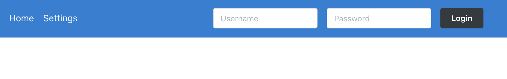
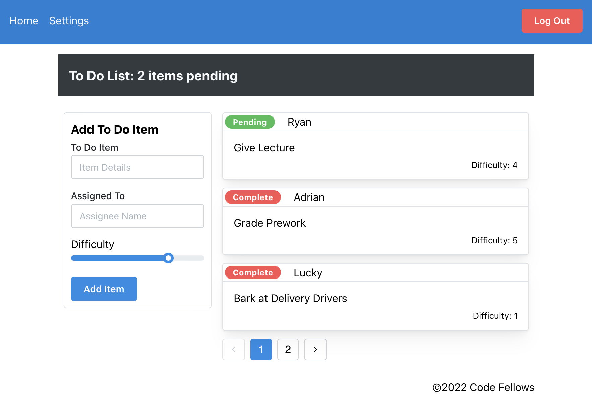

# ToDo-APP - lab 31 10/31/2022

A web application that involves us refactoring another teams code, modularize code and use [Mantine](https://mantine.dev/) to style. This app will use react Context. Context provides a means of passing state down the component tree through a Provider/Consumer relationship.

Used Demo as Reference for labs 31 & 32.

[phase1 - code-sandbox](https://codesandbox.io/p/github/Junyoungson808/todo-app/draft/loving-tu?file=%2FREADME.md&workspace=%257B%2522activeFileId%2522%253A%2522cl9xnjhxx0000lrkg3cb7e4fz%2522%252C%2522openFiles%2522%253A%255B%2522%252FREADME.md%2522%255D%252C%2522sidebarPanel%2522%253A%2522EXPLORER%2522%252C%2522gitSidebarPanel%2522%253A%2522COMMIT%2522%252C%2522sidekickItems%2522%253A%255B%257B%2522key%2522%253A%2522cl9xnjkgq000o356h0pnotzbu%2522%252C%2522type%2522%253A%2522PROJECT_SETUP%2522%252C%2522isMinimized%2522%253Afalse%257D%252C%257B%2522type%2522%253A%2522PREVIEW%2522%252C%2522taskId%2522%253A%2522start%2522%252C%2522port%2522%253A3000%252C%2522key%2522%253A%2522cl9xnk0u40068356hzduppp8z%2522%252C%2522isMinimized%2522%253Afalse%257D%252C%257B%2522type%2522%253A%2522TASK_LOG%2522%252C%2522taskId%2522%253A%2522start%2522%252C%2522key%2522%253A%2522cl9xnjxxd004a356hsocitiyc%2522%252C%2522isMinimized%2522%253Afalse%257D%255D%257D)

<!-- [phase2 - code-sandbox]() -->

<!-- [phase3 - code-sandbox]()
[phase4 - code-sandbox]() -->

## Setup

  Phase1:

- npx create-react-app todo-app
- remove/replace src folder in basic react app
- bring in demo code
- npm i  <!-- bring in demo code/src folder -->
- push to github
  - git remote add origin <https://github.com/Junyoungson808/todo-app.git>

  Phase3:
- npm install react-cookie // npm install react-cookies --save
- npm install jwt-decode

## Technical Requirements

Phase 1:

## 

Implement the React context API for defining settings across the entire application.

- Create a context for managing application display settings and provide this at the application level.
- Display or Hide completed items (boolean).
- Number of items to display per screen (number).
- Default sort field (string).
- Manually set (hard code) those state settings in the context provider’s state, they should not be changeable.
- Consume and utilize context values throughout your components
- Show a maximum of a certain number of items per screen in the <List /> component
- Use the Mantine Pagination component to let the users navigate a long list of items
- Hide completed items in the list (the ability to show will be added in a later lab)

Phase 2:

## .png)

Implement the Context API to make some basic application settings available to components.

- How many To Do Items to show at once
- Whether or not to show completed items
- Provide the users with a form where they can change the values for those settings
- This should be given in the form of a new component, perhaps linked to from the main navigation
- Once settings are updated, render the updated settings to the right of the “form”. Consider using Grid, Card, and When components.
- Save the users choices in Local Storage
- Retrieve their preferences from Local Storage and apply them to the application on startup

Phase 3:

## .png)

In Phase 3, we’d like to extend the functionality of the application by requiring users be logged in to view items and also restrict access based on user type. The user stories from Phases 1, and 2 remain unchanged. For this phase, we are now adding the following new user stories.

- As a user, I want to provide a way for other users to create new accounts
- As a user, I want to provide a way for all users to login to their account
- As a user, I want to make sure that my To Do items are only viewable to users that have logged in with a valid account.
- As a user, I want to ensure that only fellow users that are allowed to “create”, based on their user type, can add new To Do Items
- As a user, I want to ensure that only fellow users that are allowed to “update”, based on their user type, can mark To Do Items complete
- As a user, I want to ensure that only fellow users that are allowed to “delete”, based on their user type, can delete new To Do Items

  
  
